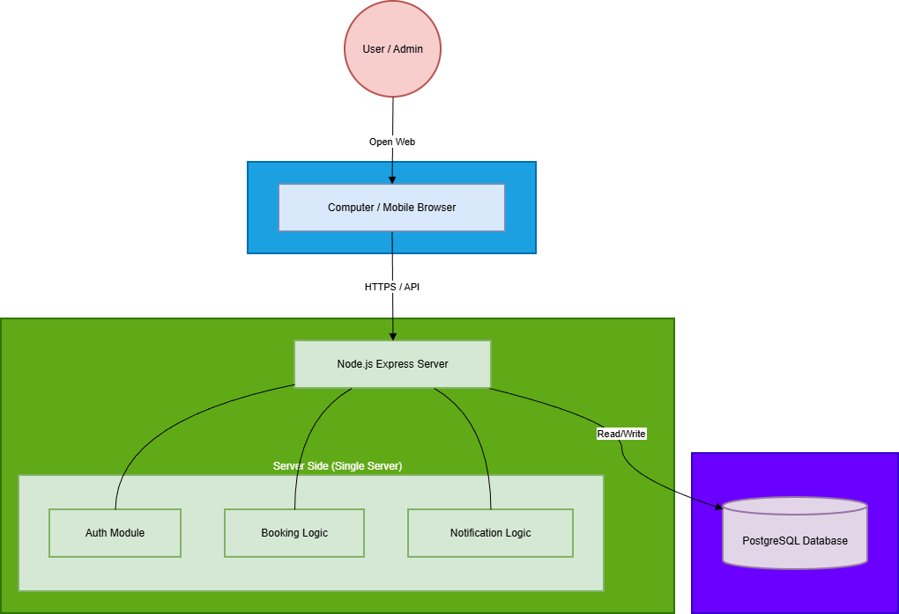
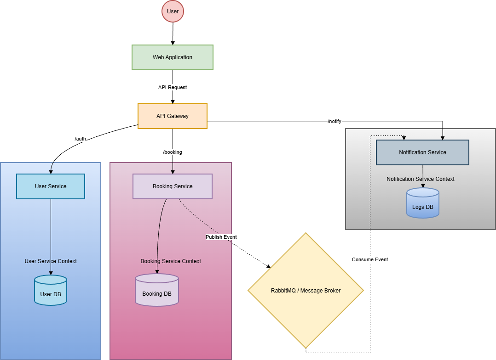

## Candidate Architecture 1: Monolithic Architecture

### Overview
โครงสร้างแบบรวมศูนย์ที่รวม Business Logic ทั้งหมด (User, Booking, Notification) ไว้ใน Application เดียวกัน (Single Process) เชื่อมต่อกับฐานข้อมูลเดียว เหมาะสำหรับการพัฒนาที่ต้องการความรวดเร็วและความซับซ้อนต่ำ

### Components
- Web Application Client: ส่วนหน้าบ้านสำหรับผู้ใช้และแอดมิน
- API Server (Monolith): โปรแกรมหลักที่รวม Logic การทำงานไว้ภายใน
- Authentication Module: จัดการการล็อกอิน
- Booking Module: จัดการตรรกะการจองและตรวจสอบห้องว่าง
- Notification Module: จัดการส่งอีเมล
- Single Database: ฐานข้อมูลศูนย์กลางสำหรับเก็บข้อมูลทุกอย่าง

### Technology Stack
- Frontend: React.js, Tailwind CSS
- Backend: Node.js, Express.js Framework
- Database: PostgreSQL (ใช้ Schema เดียวเก็บทุกตาราง)
- Others: JWT (ยืนยันตัวตน), Nodemailer (ส่งเมล), Docker (สำหรับการรัน App)

### Architectural Patterns
- Layered Architecture (Presentation, Business, Data Access Layers)
- Monolithic Pattern

### Diagram

### Pros & Cons
- ✅ **Pros:** พัฒนาได้เร็วมาก (Time-to-market), ติดตั้งและดูแลรักษาง่าย, ค่าใช้จ่ายต่ำ
- ❌ **Cons:** ขยายขนาด (Scale) ยากในอนาคต, ถ้า Server ล่มจะใช้งานไม่ได้ทั้งระบบ

---

## Candidate Architecture 2: Microservices Architecture

### Overview
โครงสร้างแบบกระจายที่แยกฟังก์ชันหลักออกเป็น Service อิสระ (User Service, Booking Service, Notification Service) โดยแต่ละ Service มีฐานข้อมูลของตัวเองและสื่อสารกันผ่าน Network

### Components
- API Gateway: ประตูด่านหน้าสำหรับรับ Request และกระจายงาน
- User Service: เซิร์ฟเวอร์แยกสำหรับจัดการข้อมูลคน
- Booking Service: เซิร์ฟเวอร์แยกสำหรับคำนวณการจอง
- Notification Service: เซิร์ฟเวอร์แยกสำหรับส่งแจ้งเตือน (Consumer)
- Message Broker: ท่อส่งข้อมูลสำหรับคุยกันระหว่าง Service (Async)

### Technology Stack
- Frontend: React.js
- Gateway: Kong API Gateway หรือ Nginx
- Backend Services:** Node.js (แยกอิสระ 3 โปรเจกต์)
- Database: Database per Service
- PostgreSQL (สำหรับ Booking/User)
- MongoDB (สำหรับ Notification Log)
- Others: RabbitMQ (Message Broker), Kubernetes (Orchestration)

### Architectural Patterns
- Microservices Pattern
- Database per Service
- API Gateway

### Diagram

### Pros & Cons
- ✅ **Pros:** รองรับการขยายตัว (Scalability) ได้ดีเยี่ยม, แยก Technology ได้อิสระ, ทนทานต่อความล้มเหลวรายจุด
- ❌ **Cons:** ความซับซ้อนสูงมาก, ใช้เวลาพัฒนานานกว่า 3 เดือน, ใช้งบประมาณสูง

---

## Evaluation

### Comparison Table

| Criteria | Weight | Arch 1: Monolith (Score) | Arch 1 (Weighted) | Arch 2: Microservices (Score) | Arch 2 (Weighted) |
|----------|--------|--------------------------|-------------------|-------------------------------|-------------------|
| Time to Market (ความเร็วในการพัฒนา) | 30% | 5 | 1.5 | 2 | 0.6 |
| Cost (ต้นทุน) | 20% | 5 | 1.0 | 2 | 0.4 |
| Complexity (ความง่าย/ซับซ้อนต่ำ) | 20% | 5 | 1.0 | 2 | 0.4 |
| Scalability (การขยายตัว) | 15% | 3 | 0.45 | 5 | 0.75 |
| Maintainability (การดูแลรักษา) | 15% | 4 | 0.6 | 3 | 0.45 |
| Total Score | 100% | | 4.55 | | 2.6 |

### Selected Architecture
Decision: เราเลือก Architecture 1: Monolithic Architecture

**Reasons:**
1. Time Constraint: คะแนนด้าน Time to Market สูงกว่ามาก ซึ่งสำคัญที่สุดเพื่อให้ทันกำหนดส่งมอบ 3 เดือน
2. Resource Match: เหมาะสมกับขนาดทีม 5 คน สามารถทำงานร่วมกันบน Codebase เดียวได้ดีกว่า
3. Budget: ใช้ทรัพยากรน้อยกว่า ช่วยประหยัดงบประมาณโครงการให้ไม่เกิน 500,000 บาท